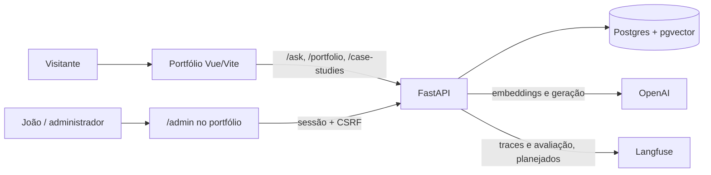
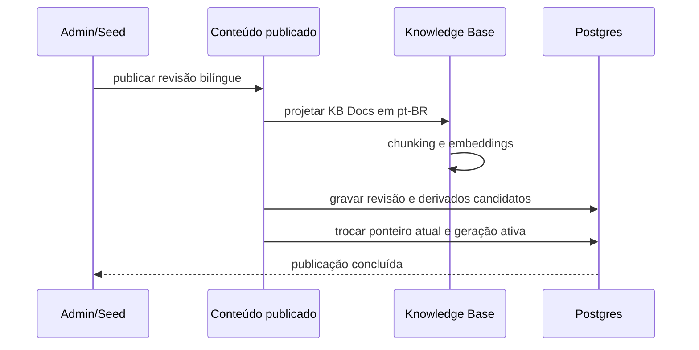
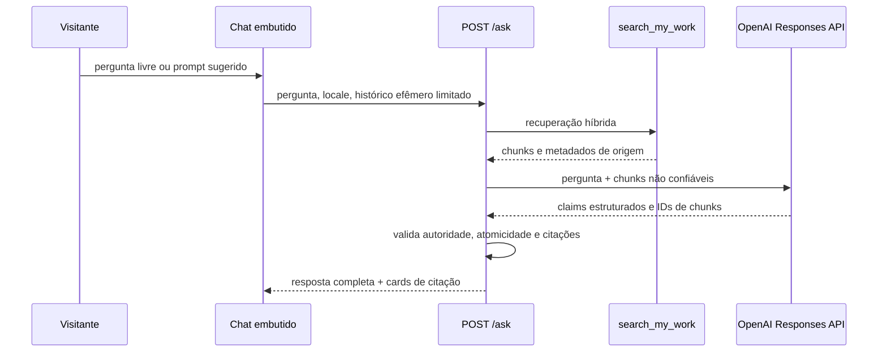

# Arquitetura

Este documento descreve a arquitetura implementada do `ask-about-me` e sua integração
com o repositório do portfólio Vue. Para os termos de domínio, consulte o
[`CONTEXT.md`](../CONTEXT.md); para decisões irreversíveis, consulte os
[ADRs](adr/).

## Visão geral

O sistema tem dois repositórios e uma única origem HTTP em produção:

Em desenvolvimento, o Vite encaminha `/ask`, `/admin` e `/portfolio` para a API em
`127.0.0.1:8000`. Em produção, o proxy reverso deve encaminhar essas rotas antes do
fallback da SPA; por isso o frontend não conhece uma URL de backend separada.

## Limites de responsabilidade

| Área | Repositório | Responsabilidade |
| --- | --- | --- |
| Portfólio público | `joaovsr.github.io` | Vue 3, apresentação, estado visual efêmero do chat e consumo dos contratos HTTP. |
| Painel admin | `joaovsr.github.io` + `ask-about-me` | Formulário Vue privado e adapters HTTP protegidos por sessão/CSRF. |
| Conteúdo publicado | `ask-about-me` | Revisões, snapshot público localizado, publicação consistente e projeção para a KB. |
| Knowledge Base | `ask-about-me` | KB Docs, chunks, embeddings, pgvector, full-text e gerações de índice. |
| RAG de Portfólio | `ask-about-me` | Retrieval, geração estruturada, validação de evidência e hidratação de citações. |

O frontend e os handlers FastAPI são adapters: não carregam regras de publicação,
indexação, autoridade de evidência ou retrieval.

## Conteúdo publicado

### Estado atual

- **Case Study**: entidade versionada e editável pelo painel admin. Cada revisão contém
  seções ordenadas em `pt-BR` e `en-US`.
- **Perfil, experiências e projetos**: migrados de arquivos estáticos para um snapshot
  de portfólio bilíngue e versionado no Postgres. A API o expõe em
  `GET /portfolio?locale=pt-BR|en-US`.
- **Histórico do snapshot**: revisões são imutáveis; `/portfolio?...&version=N` resolve
  uma versão específica, e a versão atual possui um `ETag` derivado de revisão e locale.

O snapshot é uma solução de transição para remover a fonte estática concorrente. O próximo
corte deve evoluir o painel para editar Profile, Experience e Project de forma granular,
com ordenação, exclusão e mídia localizada.

### Publicação consistente

Se a validação, a geração de embeddings ou a ativação falhar, a transação não troca a
versão atual nem a geração ativa: o portfólio e o RAG continuam atendendo a revisão anterior.

## Knowledge Base e retrieval

Cada conteúdo indexável é convertido em um **KB Doc**:

| Conteúdo | `doc_type` | Uso de evidência |
| --- | --- | --- |
| Case Study | `case_study` | Experiência prática, maior força factual. |
| Perfil, Experience e Project | `profile` | Informação auto-declarada. |
| Essay | `essay` | Opinião técnica; ainda não implementado. |

O texto canônico indexado no V1 é `pt-BR`. A Knowledge Base cria chunks preservando
seções e registra uma geração com perfil de embedding, modelo, dimensões e versão do
chunker. A busca única `search_my_work` combina pgvector e full-text search em português
por Reciprocal Rank Fusion.

Uma publicação somente substitui os documentos de origem afetados e copia os documentos
ativos não afetados para a nova geração. Isso mantém Case Studies e Profile Docs coexistindo
sem misturar configurações de embedding incompatíveis.

## Fluxo do RAG de Portfólio

O backend não persiste conversas. O modelo recebe evidências recuperadas como dados não
confiáveis e sua saída é validada antes de o frontend receber texto e citações.

## Contratos HTTP principais

| Rota | Papel |
| --- | --- |
| `GET /health/live` | Liveness do processo. |
| `GET /health/ready` | Readiness da API e banco. |
| `GET /portfolio?locale=&version=` | Snapshot público localizado; `version` é opcional. |
| `GET /case-studies/{slug}?locale=` | Leitura pública do Case Study atual. |
| `POST /ask` | RAG retrieve-then-generate. |
| `POST /admin/session` | Inicia sessão do proprietário. |
| `GET /admin/csrf` | Entrega token CSRF para mutações. |
| `/admin/case-studies` | Lista, lê e publica Case Studies. |

O cookie de sessão é HTTP-only, `SameSite=Strict` e seguro por padrão. Em desenvolvimento,
`AAM_ADMIN_COOKIE_SECURE=false` permite testar em HTTP local; produção deve usar HTTPS.

## Persistência

- **Postgres** é a fonte de verdade para conteúdo publicado, revisões e geração ativa da KB.
- **pgvector** guarda embeddings dos chunks.
- `case_studies`, `case_study_revisions` e `case_study_sections` guardam Case Studies.
- `portfolio_content_snapshots` guarda revisões do snapshot de perfil, experiências e projetos;
  apenas uma revisão por snapshot é marcada como atual.
- `kb_index_generations`, `kb_documents` e `kb_chunks` guardam índices ativos e candidatos.

Migrations Alembic preservam a evolução do schema. O seed de desenvolvimento é idempotente
e usa hash embeddings quando não há uma geração OpenAI ativa; se houver, utiliza o mesmo
perfil OpenAI para impedir a mistura de vetores incompatíveis.

## Configuração e operações

- Secrets ficam somente no backend, por meio de `.env` ignorado pelo Git e prefixo `AAM_`.
- OpenAI é o primeiro provedor de embedding e geração; interfaces estreitas permitem trocar
  o adapter sem reescrever Knowledge Base ou RAG.
- O Golden Dataset e Langfuse fazem parte da arquitetura alvo de qualidade e observabilidade;
  sua instrumentação ainda é um trabalho pendente.
- A publicação é síncrona no V1. Caso o tempo de publicação se torne inaceitável, qualquer
  fila ou estado pendente exige revisar os ADRs 0004 e 0007.

## Próximos limites a fechar

1. Editor admin granular para Profile, Experience e Project, incluindo ordenação e exclusão.
2. Mídia persistente com identidade, ordem e alt text localizado.
3. Migração de Skills, Education e Certifications para o snapshot publicado.
4. Essays, Suggested Prompts e páginas públicas versionadas para todas as citações.
5. Golden Dataset automatizado e traces/redação no Langfuse.
